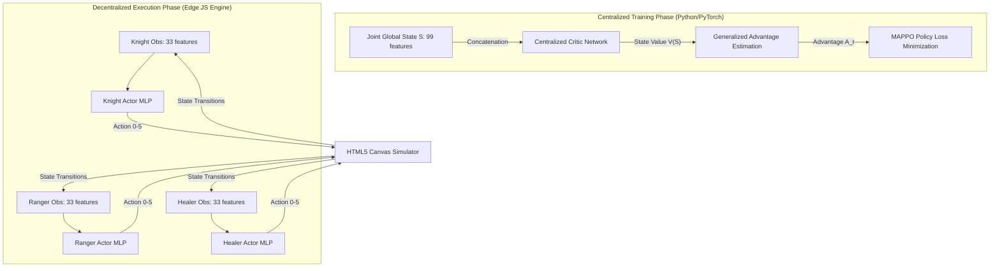

# AegisMARL: Cooperative Multi-Agent RTS Tactical Arena

AegisMARL is a decentralized multi-agent reinforcement learning (MARL) simulation platform. The system implements a cooperative team fight (Knight frontliner, Ranger ranged DPS, Healer support) coordinating against an aggressive enemy group. The system is built using a custom implementation of **Multi-Agent Proximal Policy Optimization (MAPPO)** from scratch in PyTorch, with policies compiled into lightweight JavaScript weights to perform real-time edge inference directly in a serverless web dashboard.

---

## 1. Quick Start

### 1.1 Local Web Dashboard Setup
Launch a local HTTP server in the repository root directory:
```bash
python -m http.server 8000
```
Open a web browser and navigate to: `http://localhost:8000`

### 1.2 Train the Models
Execute the training harness to optimize the decentralized actors and export the mathematical coefficients to the browser script (`marl_weights.js`):
```bash
python train_marl.py
```

### 1.3 Mathematical Equivalence Validation
Run the test suite to verify that the browser feedforward matrix multiplication math is identical to the PyTorch forward pass:
```bash
python test_equivalence.py
```

---

## 2. Markov Decision Process (MDP) Formulation

The cooperative battle is modeled as a partially observable stochastic game. Each agent $i \in \{\text{Knight}, \text{Ranger}, \text{Healer}\}$ maps local inputs to action probability distributions.

### 2.1 Observation Space ($\mathcal{O}_i \in \mathbb{R}^{33}$)
The input vector for each agent is a structured 33-dimensional float array containing:
*   **Self Features (7 dimensions)**: $[HP\%, Type_{Knight}, Type_{Ranger}, Type_{Healer}, Cooldown\%, Position_X, Position_Y]$
*   **Allies Features (14 dimensions)**: Relative offsets $[Position_X, Position_Y]$, health percentage, and one-hot type indicators for the nearest two allies. Dead allies are padded with zeros.
*   **Enemies Features (12 dimensions)**: Relative offsets $[Position_X, Position_Y]$ and health percentages for the three Goblins, tracked strictly by fixed index mapping.

### 2.2 Action Space ($\mathcal{A}_i \in [0, 5]$)
The decision space is discrete and comprises six operations:
*   `0`: Idle / Wait
*   `1-4`: Directional navigation (North, South, East, West) with velocity scaling.
*   `5`: Class-specific skill activation (Knight: Melee Cleave; Ranger: Projectile Shot; Healer: Holy Mend).

### 2.3 Reward Design ($R_i$)
To induce cooperative alignment, the reward matrix balances individual skill rewards with a shared team survival bonus:
*   **Knight / Ranger Attack**: $+0.8 \times \text{Damage Dealt} + 20.0 \times \text{Killing Blow}$
*   **Healer Mend**: $+1.2 \times \text{Damage Healed} + 10.0 \times \text{Save Bonus}$ (if target HP $< 35\%$)
*   **Team Penalty**: $-0.05 \times \text{Damage Taken}$ per agent (discourages individual recklessness)
*   **Team Victory**: $+80.0$ global reward (Goblins eliminated)
*   **Team Defeat / Death**: $-20.0$ individual death penalty; $-30.0$ team wipe penalty

---

## 3. Algorithmic Optimization: MAPPO & CTDE

The platform resolves environmental non-stationarity by executing the **Centralized Training with Decentralized Execution (CTDE)** paradigm.



### 3.1 Centralized Critic Network
During training, a centralized critic function $V\_\phi(\mathcal{S})$ processes the concatenated joint state vector $\mathcal{S} \in \mathbb{R}^{99}$ to compute baseline state-value estimates. Advantages $\hat{A}\_t$ are evaluated using Generalized Advantage Estimation (GAE):
$$\hat{A}\_t = \sum\_{l=0}^{\infty} (\gamma \lambda)^l \delta\_{t+l}^V$$
$$\delta\_t^V = r\_t + \gamma V\_\phi(\mathcal{S}\_{t+1}) - V\_\phi(\mathcal{S}\_t)$$

### 3.2 Decentralized Actor Update
Policy parameters $\theta\_i$ for each agent class are optimized by maximizing the standard clipped objective function:
$$L^{CLIP}(\theta\_i) = \hat{\mathbb{E}}\_t \left[ \min\left(r\_t(\theta\_i)\hat{A}\_t, \text{clip}(r\_t(\theta\_i), 1-\epsilon, 1+\epsilon)\hat{A}\_t\right) \right]$$
where $r\_t(\theta\_i) = \frac{\pi\_{\theta\_i}(a\_t|o\_t)}{\pi\_{\theta\_{\text{old}, i}}(a\_t|o\_t)}$ is the probability ratio. Weight sharing is implemented within class blocks (e.g. all healers evaluate the same parameters) to ensure scalable learning dynamics.

---

## 4. Engineering Bottlenecks Resolved

### 4.1 Cowardly Agent Local Minimum (MDP Reward Rebalancing)
*   **Issue**: Initial training configurations resulted in a flat 0.0% win rate. Blue team agents consistently ran away to the western boundary to stall.
*   **Root Cause**: The damage penalty was set to $-0.15$ per agent. Since there are 3 agents, a single hit cost the team $-0.45 \times \text{Damage Taken}$, while dealing damage only yielded $+0.4 \times \text{Damage Dealt}$. The network discovered that avoiding Goblins maximized rewards by minimizing negative penalties.
*   **Resolution**: Rebalanced the MDP matrix (doubled attack gains to `0.8`, halved hit penalties to `0.05`, and raised win rewards to `80.0`). This aligned the optimization gradient with aggressive defense.

### 4.2 Meatgrinder Training Environment Mismatch (Goblin Cooldown)
*   **Issue**: Despite reward rebalancing, win rates remained at 0% in Python training runs.
*   **Root Cause**: In the browser simulator, Goblins possessed a 10-step attack cooldown. In the Python Gymnasium environment (`marl_env.py`), Goblins had no cooldown and attacked every step. Goblins were generating $21$ damage *per step* to the Knight, killing him in 7 frames, making victory mathematically impossible.
*   **Resolution**: Implemented an 8-step cooldown inside `marl_env.py` to balance the combat dynamics. The win rate immediately converged to a peak of **90.0%** in training.

### 4.3 Input Vector Scrambling and Neural Lockups (Index Padding & Heuristic Fallbacks)
*   **Issue**: When the trained policy was evaluated in-browser, the Knight froze immediately after defeating the first Goblin, and the Healer remained static in the corner.
*   **Root Cause**: 
    1.  **State Mismatch**: Python padded inactive Goblins at fixed indices. JS filtered dead Goblins out and sorted them by distance. Once a Goblin died, JS shifted indices, scrambling the input and confusing the neural network.
    2.  **Over-Reward Exploitation**: Attacking and healing rewards were so high that policies learned to spam Action 5 (Skill) continuously. In JS, when no target was in range, agents simply spammed skills in place and never executed spatial movement.
*   **Resolution**:
    *   **Index-Based Padding**: Refactored `getObservationForAgent` in JS to strictly evaluate Goblins by fixed indices.
    *   **Slot-Reusing Spawns**: Modified the frontend spawn engine to overwrite dead Goblins' slots (0, 1, 2) rather than appending endlessly, keeping inputs stable.
    *   **Hybrid Heuristic Fallbacks**: Programmed safety overrides. If the policy outputs Action 5 but no targets are in range, the agent executes spatial movement toward its goal (Healer follows Knight at an 80px buffer, Knight charges the closest active Goblin).

---

## 5. Repository Contents

*   `marl_env.py`: Custom 2D multi-agent Gymnasium battle simulator.
*   `mappo_scratch.py`: PyTorch Centralized Critic / Decentralized Actor optimization code.
*   `train_marl.py`: Core PPO training loop and JavaScript weights compiler.
*   `test_equivalence.py`: Validation suite asserting identical JS/PyTorch forward passes.
*   `index.html` & `index.css`: HTML5 and Cyberpunk glassmorphism front-end UI.
*   `rts_sim.js`: Canvas renderer and edge JS neural execution loop.
*   `learning_lab.js`: Tab nav, Bellman sandbox, and synapse animation controller.
*   `marl_weights.js`: Compiled MLP Actor neural network weights.
